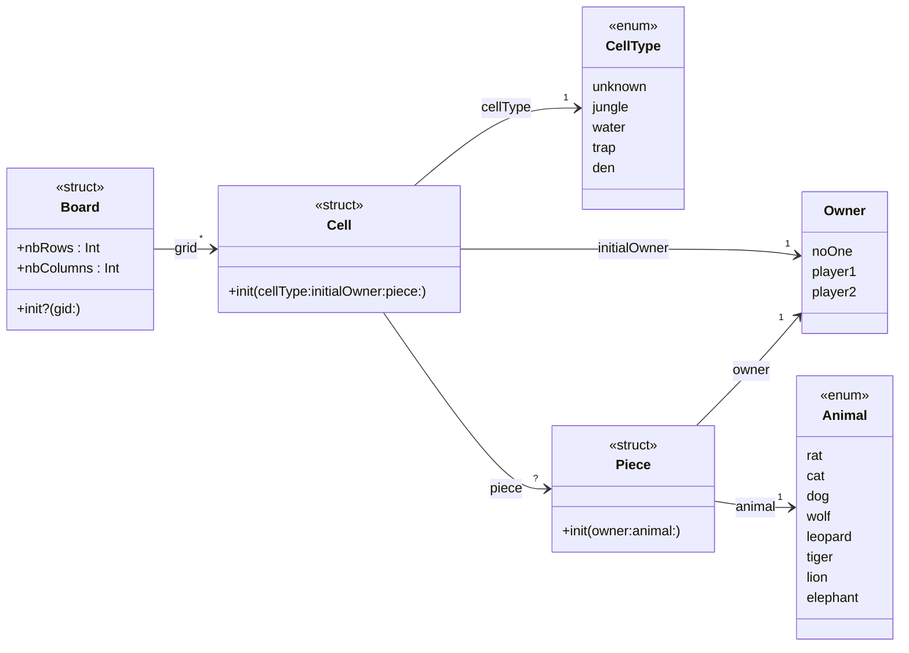

# DouShouQi-SwiftGame

## Description of the game
This project is a DouShouQi command line game coded in swift and usable in your terminal.

Dou Shou Qi, also known as "The Jungle Game" or "The Game of Fighting Animals," is a traditional Chinese strategy board game that dates back over a thousand years. The game is often referred to as the Chinese Animal Chess or Jungle Chess. It is a two-player game that simulates a battle between two armies, each represented by different animal pieces with varying abilities.

## About the code
To launch the project, open the `xcworkspace` file in XCode and run the project `DouShouQi_CLI`.

Here is the class diagramm of the `Model` package:



The output is the DouShouQi board, presented as follow:
```
	🌿🦁🟡		🌿  		🪤  		🪹  		🪤  		🌿  		🌿🐯🟡	

	🌿  		🌿🐶🟡		🌿  		🪤  		🌿  		🌿🐱🟡		🌿  	

	🌿🐭🟡		🌿  		🌿🐆🟡		🌿  		🌿🐺🟡		🌿  		🌿🐘🟡	

	🌿  		💧  		💧  		🌿  		💧  		💧  		🌿  	

	🌿  		💧  		💧  		🌿  		💧  		💧  		🌿  	

	🌿  		💧  		💧  		🌿  		💧  		💧  		🌿  	

	🌿  		💧  		💧  		🌿  		💧  		💧  		🌿  	

	🌿🐘🔴		🌿  		🌿🐺🔴		🌿  		🌿🐆🔴		🌿  		🌿🐭🔴	

	🌿  		🌿🐱🔴		🌿  		🪤  		🌿  		🌿🐶🔴		🌿  	

	🌿🐯🔴		🌿  		🪤  		🪹  		🪤  		🌿  		🌿🦁🔴	
```

## Progress
So far, only the board of the game is implemented, the rest (rules, players, turn-by-turn game) will follow soon.

Here is Mr Chevaldonné' citerias table with a check of everything I did for this TP, so that you can follow my progress.

 niveau |	description	 | status |	coeff | pénalités TP2 |	pénalités TP3 
---|---|---|---|---|---
☢️ | Le dépôt doit être accessible par l'enseignant |✅| ☢️ | | 
☢️ | un .gitignore doit exister au premier push |✅| ☢️ | | 
🎬 | les Packages et le test compilent | ✅ | 4 | 50% | 75% 
🎬 | le test s'exécute sans bug | ✅ | 4 | 50% | 75% 
3️⃣ | tous mes projets sont dans le même workspace | ✅ | 2 | 50% | 75% 
1️⃣ | j'ai créé un Package Model | ✅ | 2 | 50% | 75% 
1️⃣ | j'ai créé l'enum CellType | ✅ | 1 | 50% | 75% 
1️⃣ | j'ai créé l'enum Owner | ✅ | 1 | 50% | 75% 
1️⃣ | j'ai créé l'enum Animal | ✅ | 1 | 50% | 75% 
3️⃣ | Owner s'affiche comme demandé sous la forme d'un String | ✅ | 1 | 50% | 75% 
1️⃣ | Piece possède bien les propriétés demandées en lecture seule non-modifiables | ✅ | 1 | 50% | 75% 
1️⃣ | Piece possède un initialiseur | ✅ | 2 | 50% | 75% 
3️⃣ | Piece est transformable en String comme demandé | ✅ | 1 | 50% | 75% 
1️⃣ | Cell possède bien les propriétés demandées en lecture seule non-modifiables|✅|1|50%|75%
1️⃣|Cell possède bien une propriété piece pouvant ne pas avoir de valeur|✅|2|50%|75%
1️⃣|Cell possède un initialiseur utilisant des valeurs par défaut pour deux paramètres|✅|2|50%|75%
3️⃣|Cell est transformable en String comme demandé|✅|1|50%|75%
1️⃣|Board possède bien les propriétés demandées en lecture seule non-modifiables|✅|1|50%|75%
1️⃣|Board possède bien un tableau à deux dimensions de cellule|✅|2|50%|75%
2️⃣|Board.grid est en lecture seule mais modifiable au sein de Board|✅|2|50%|75%|
1️⃣|Board possède un initialiseur permettant d'initialiser toutes ses propriétés|✅|2|50%|75%
2️⃣|l'initialiseur de Board vérifie les contraintes et renvoie nil si nécessaire|✅|3|50%|75%
3️⃣|j'ai créé un Package avec les extensions pour l'affichage en lignes de commande|✅|2|50%|75%
3️⃣|j'ai créé une extensions pour CellType|✅|1|50%|75%
3️⃣|j'ai créé une extensions pour Animal|✅|1|50%|75%
3️⃣|j'ai créé une extensions pour Owner|✅|1|50%|75%
3️⃣|j'ai créé une extensions pour Board|✅|2|50%|75%
2️⃣|j'ai créé une application de type Command Line Tool utilisant les deux Packages précédents|✅|2|50%|75%
2️⃣|j'initialise correctement Board dans le test|✅|2|50%|75%
3️⃣|j'affiche correctement Board dans le test|✅|1|50%|75%
3️⃣|mon dépôt possède un readme qui apporte quelque chose...|✅|2|50%|75%
3️⃣|mon code est commenté|🟡|1|50%|75%

Enjoy the game 🎉 (well, the grid at least).