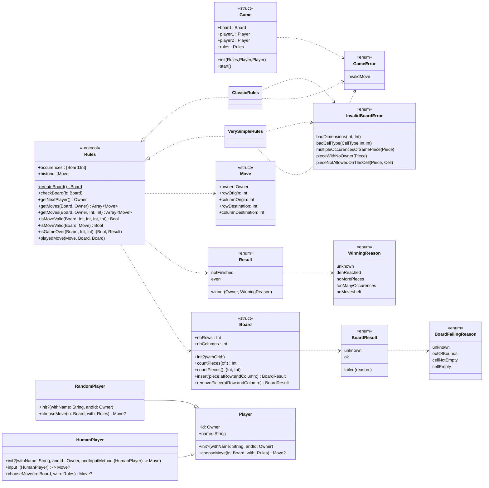

# DouShouQi-SwiftGame

This project is a DouShouQi command line game coded in swift and usable in your terminal.

To launch the project, open the `xcworkspace` file in XCode and run the project `DouShouQi_CLI`.

## Commit for correction

To evaluate my work, you can base yourself on the last commit of the branch `tp5`


## Project and Packages

Project `DouShouQi_CLI` : The command line interface of the game

Package `Model`: Model of the application, containing structures, enumerations and tests

Package `ModelEmojiDisplayer`: Model extensions to improve the display of the board in CLI 


## Launch the project and the test

To be able to launch the project, you have to clone this repo and open it in XCode.

If you want to **play a game**, you have to build the Model, then the EmojiDisplayer and finally select and start the project`DouShouQi_CLI`.

You will be able to create the players of the game between two kinds of Player, humanPlayer (you will manually type your moves) and randomPlayer (bot that is playing a random valid move) on a simplified board (the real board will come soon I hope).

If you want to **launch the unit and performance tests**, select the package `Model` and in the Scheme menu, edit the scheme to `Test` and run `Model`.


## class Diagramm



## Progress
	
Here is Mr Chevaldonné' citerias table filled with my auto evaluation on everything I did for this TP, so that you can follow my progress.

niveau | description | coeff  | status | pénalités TP6  
--- | --- | --- | --- | ---
☢️ | Le dépôt doit être accessible par l'enseignant | ☢️ |✅| 
☢️ | un .gitignore doit exister au premier push | ☢️  |✅|
🎬 | les *Packages* et le test compilent | 1 |✅| 50%  
🎬 | le test et les tests unitaires s'exécutent sans bug | 2 |✅| 50%  
1️⃣ | j'ai enrichi l'enum ```GameError``` | 1 |🔴| 50% | 75%
1️⃣ | j'ai créé la structure ```Game```, ses membres et son initialiseur | 1 |✅| 50%  
1️⃣ | j'ai ajouté la fonction ```start()``` et géré la boucle de jeu | 6 |✅| 50%  
1️⃣ | j'ai ajouté la notification sur le démarrage du jeu | 1 |✅| 50%  
1️⃣ | j'ai abonné une méthode à la notification sur le démarrage du jeu | 1 |✅| 50%  
1️⃣ | j'ai testé la notification sur le démarrage du jeu | 1 |✅| 50%  
1️⃣ | j'ai ajouté la notification indiquant quel est le prochain joueur | 2 |✅| 50%   
1️⃣ | j'ai abonné une méthode à la notification indiquant quel est le prochain joueur | 2 |✅| 50%  
1️⃣ | j'ai testé la notification indiquant quel est le prochain joueur | 2 |✅| 50%  
1️⃣ | j'ai ajouté la notification donnant des informations sur la fin de partie (partie en cours, terminée, vainqueur...) | 4 |✅| 50%  
1️⃣ | j'ai abonné une méthode à la notification donnant des informations sur la fin de partie (partie en cours, terminée, vainqueur...) | 4 |✅| 50%  
1️⃣ | j'ai testé la notification donnant des informations sur la fin de partie (partie en cours, terminée, vainqueur...) | 4 |✅| 50%  
2️⃣ | j'ai ajouté la notification indiquant que le plateau de jeu a changé | 1 |✅| 50%  
2️⃣ | j'ai abonné une méthode à la notification indiquant que le plateau de jeu a changé | 1 |✅| 50%  
2️⃣ | j'ai testé la notification indiquant que le plateau de jeu a changé | 1 |✅| 50%  
3️⃣ | j'ai ajouté la notification indiquant quel coup a été choisi | 1 |✅| 50%  
3️⃣ | j'ai abonné une méthode à la notification indiquant quel coup a été choisi | 1 |✅| 50%  
3️⃣ | j'ai testé la notification indiquant quel coup a été choisi | 1 |✅| 50%  
3️⃣ | j'ai ajouté la notification indiquant que le coup choisi n'est pas valide | 1 |✅| 50%  
3️⃣ | j'ai abonné une méthode à la notification indiquant que le coup choisi n'est pas valide | 1 |✅| 50%  
3️⃣ | j'ai testé la notification indiquant que le coup choisi n'est pas valide | 1 |✅| 50%  
2️⃣ | mon test permet de lancer une partie entre deux joueurs aléatoires | 1 |✅| 50%  
2️⃣ | mon test permet de lancer une partie entre un joueur aléatoire et un joueur humain | 4 |✅| 50%  
2️⃣ | mon test permet de lancer une partie entre deux joueurs humains | 4 |✅| 50%  
3️⃣ | mon dépôt possède un readme qui apporte quelque chose... | 2 |🚧| 50%  
3️⃣ | mon code est commenté | 1 |🚧| 50% 

Enjoy the game 🎉.