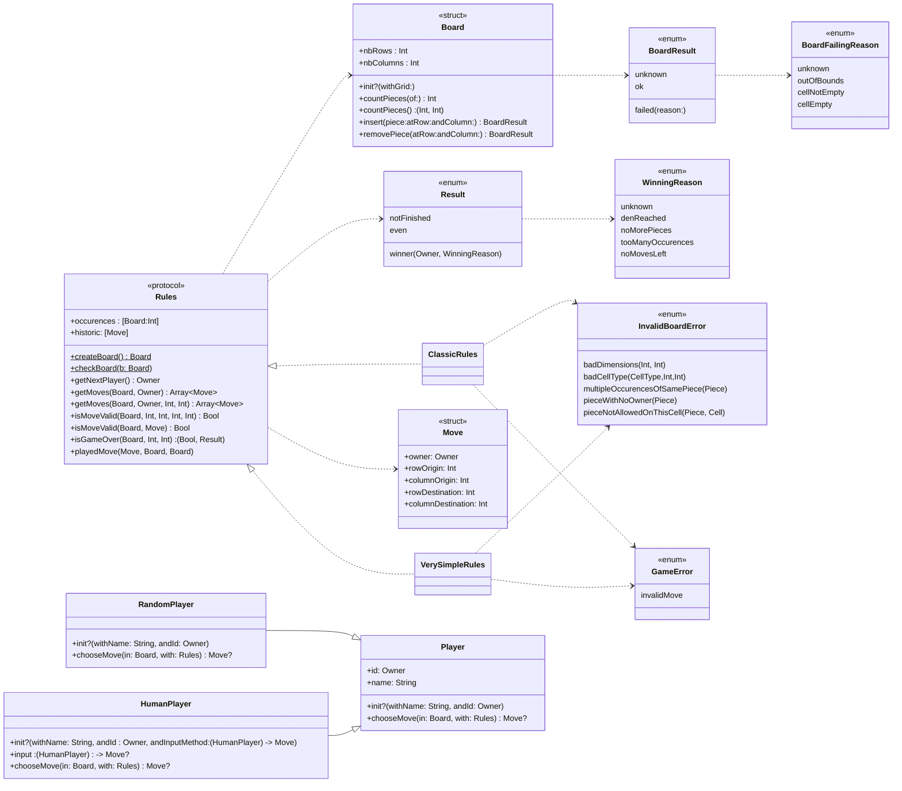

# DouShouQi-SwiftGame

This project is a DouShouQi command line game coded in swift and usable in your terminal.
So far, only the board of the game is coded, the rest will follow soon.

To launch the project, open the `xcworkspace` file in XCode and run the project `DouShouQi_CLI`.

Here is Mr Chevaldonné' citerias table with a check of everything i did for this TP

## Commit for correction

To evaluate my work, you can base yourself on the last commit of the branch `tp4`


## Project and Packages

Project `DouShouQi_CLI` : The command line interface of the game

Package `Model`: Model of the application, containing structures, enumerations and tests

Package `ModelEmojiDisplayer`: Model extensions to improve the display of the board in CLI 


## Launch the project and the test

To be able to launch the project, you have to clone this repo and open it in XCode.

If you want to **play a game against a randomPlayer**, you have to select `DouShouQi_CLI` and build the project.

You will be able to play a game against a randomPlayer (bot that is playing a random valid move) on a simplified board (the real board will come soon I hope)

If you want to **launch the unit and performance tests**, select the package `Model` in the Scheme menu, edit the scheme to `Test` and run them. `Model` is 100% covered by the tests.


## Diagramm class



## Progress
	
Here is Mr Chevaldonné' citerias table filled with my auto evaluation on everything I did for this TP, so that you can follow my progress.

niveau | description | status | coeff | pénalités TP5 | pénalités TP6  
--- | --- | --- | --- | --- | ---
☢️ | Le dépôt doit être accessible par l'enseignant |✅ | ☢️ 
☢️ | un .gitignore doit exister au premier push |✅ | ☢️
🎬 | les *Packages* et le test compilent |✅ | 1 | 50% | 75%
🎬 | le test et les tests unitaires s'exécutent sans bug || 2 | 50% | 75%
1️⃣ | j'ai créé la classe ```Player``` |✅ | 1 | 50% | 75%
1️⃣ | j'ai créé la classe ```RandomPlayer``` |✅ | 1 | 50% | 75%
1️⃣ | j'ai créé la classe ```HumanPlayer``` |✅ | 2 | 50% | 75%
1️⃣ | j'ai ajouté l'injection de dépendance pour la saisie dans ```HumanPlayer``` |✅ | 4 | 50% | 75%
2️⃣ | j'ai écrit les tests unitaires pour ```RandomPlayer``` |✅ | 2 | 50% | 75%
2️⃣ | j'ai écrit les tests unitaires pour ```HumanPlayer``` | ✅ |3 | 50% | 75%
1️⃣ | j'ai testé dans une application en lignes de commande l'utilisation de ```RandomPlayer``` dans une boucle de jeu |✅| 3 | 50% | 75%
1️⃣ | j'ai testé dans une application en lignes de commande l'injection d'une méthode de saisie pour ```HumanPlayer``` |✅| 2 | 50% | 75%
1️⃣ | j'ai testé dans une application en lignes de commande l'utilisation de ```HumanPlayer``` dans une boucle de jeu | ✅|2 | 50% | 75%
3️⃣ | ma couverture de tests pour *Model* dépasse les 90% |✅ | 2 | 50% | 75%
3️⃣ | mon dépôt possède un readme qui apporte quelque chose... | ✅ |1 | 50% | 75%
3️⃣ | mon code est commenté |✅| 1   | 50% | 75%
🎉 | j'ai ajouté une IA || - | 50% | 75%

Enjoy the game 🎉.