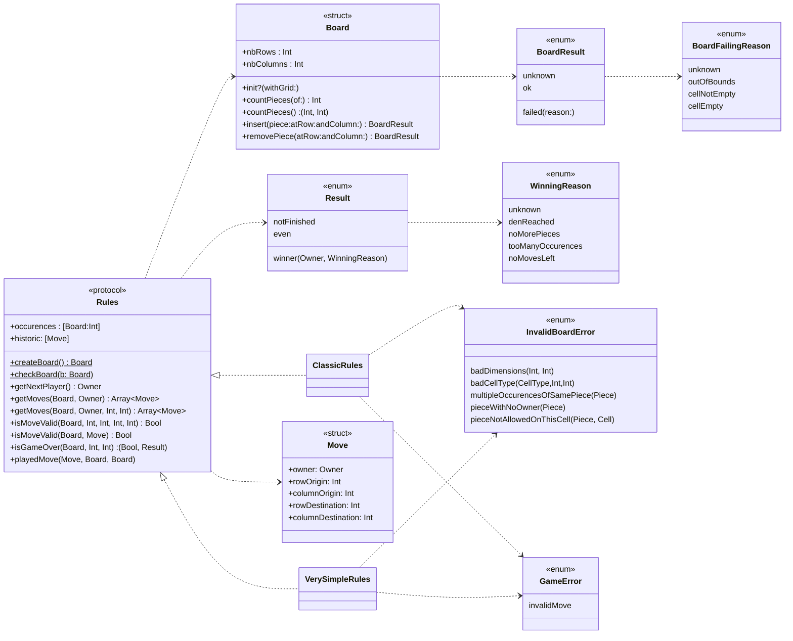

# DouShouQi-SwiftGame

This project is a DouShouQi command line game coded in swift and usable in your terminal.
So far, only the board of the game is coded, the rest will follow soon.

To launch the project, open the `xcworkspace` file in XCode and run the project `DouShouQi_CLI`.

Here is Mr Chevaldonné' citerias table with a check of everything i did for this TP

## Commit for correction

To evaluate my work, you can base yourself on the last commit of the branch `tp2`

Commit hash : `toChange`

## Project and Packages

Project `DouShouQi_CLI` : The command line interface of the game

Package `Model`: Model of the application, containing structures, enumerations and tests

Package `ModelEmojiDisplayer`: Model extensions to improve the display of the board in CLI 


## Launch the project and the test

To be able to launch the project, you have to clone this repo and open it in XCode.

If you want to **launch the project and see the command line tests results**, you have to select `DouShouQi_CLI` and build the project.

The output is the DouShouQi board, presented as follow:
```
	🌿  		🌿🦁🟡		🪹  		🌿🐯🟡		🌿  	

	🌿🐭🟡		🌿  		🌿🐱🟡		🌿  		🌿🐘🟡	

	🌿  		🌿  		🌿  		🌿  		🌿  	

	🌿🐘🔴		🌿  		🌿🐱🔴		🌿  		🌿🐭🔴	

	🌿  		🌿🐯🔴		🪹  		🌿🦁🔴		🌿  	
```

Is you want to **launch the unit and performance tests**, select the package `Model` in the Scheme menu, edit the scheme to `Test` and run them. `Model` is 100% covered by the tests.

The rules of the DoudhouQi have been simpled, so the board is not the official board and rules. You can check the rules in the structure `VerySimpleRules`, but don't worry, the ijmplementation of the `ClassicRules` of the game are in progress 🚧 🚧 🚧

## Diagramm class



## Progress

So far, only the board of the game is implemented, the rest (rules, players, turn-by-turn game) will follow soon.
	
Here is Mr Chevaldonné' citerias table filled with my auto evaluation on everything I did for this TP, so that you can follow my progress.

niveau | description | coeff | status | pénalités TP4 | pénalités TP5  
--- | --- | --- | --- | --- | ---
☢️ | Le dépôt doit être accessible par l'enseignant | ☢️ |✅
☢️ | un .gitignore doit exister au premier push | ☢️ |✅
🎬 | les *Packages* et le test compilent | 3 |✅| 50% | 75%
🎬 | le test et les tests unitaires s'exécutent sans bug | 5|✅ | 50% | 75%	
1️⃣ | j'ai créé l'enum ```WinningReason``` | 1 |✅| 50% | 75%
1️⃣ | j'ai créé l'enum ```Result``` | 3 |✅| 50% | 75%
1️⃣ | j'ai créé la structure ```Move``` | 2 |✅| 50% | 75%	
3️⃣ | j'ai ajouté une description à ```Move``` | 1 |✅| 50% | 75%
1️⃣ | j'ai créé le protocole ```Rules``` | 1 |✅| 50% | 75%
3️⃣ | j'ai modifié ```Board``` à cause du protocole ```Rules``` | 2 |✅| 50% | 75%
3️⃣ | j'ai testé ces modifications | 2 |✅| 50% | 75%
1️⃣ | j'ai ajouté le type ```VerySimpleRules``` | 1 |✅| 50% | 75%
1️⃣ | j'ai écrit ```createBoard``` | 1 |✅| 50% | 75%
1️⃣ | j'ai créé l'enum ```InvalidBoardError``` | 2 |✅| 50% | 75%
1️⃣ | j'ai créé l'enum ```GameError``` | 2 |✅| 50% | 75%
1️⃣ | j'ai écrit ```checkBoard``` | 4 |✅| 50% | 75%	
2️⃣ | j'ai écrit les tests unitaires pour ```checkBoard``` | 3 |✅| 50% | 75
1️⃣ | j'ai écrit ```getMoves``` (x2) | 3 |✅| 50% | 75%
2️⃣ | j'ai écrit les tests unitaires pour ```getMoves``` | 2 |✅| 50% | 75%	
1️⃣ | j'ai écrit ```isValidMove```, ```getNextPlayer``` | 6 |✅| 50% | 75%	
2️⃣ | j'ai écrit les tests unitaires pour  ```isValidMove```, ```getNextPlayer``` | 3 |✅| 50% | 75%
1️⃣ | j'ai écrit ```playedMove``` et géré l'historique | 1 |✅| 50% | 75%
2️⃣ | j'ai écrit les tests unitaires pour  ```playedMove``` | 1 |✅| 50% | 75%	
1️⃣ | j'ai écrit ```isGameOver``` | 6 |✅| 50% | 75%
2️⃣ | j'ai écrit les tests unitaires pour  ```isGameOver``` | 3 |✅| 50% | 75%
3️⃣ | ma couverture de tests pour *Model* dépasse les 70% | 3 |✅| 50% | 75%
3️⃣ | ma couverture de tests pour *Model* dépasse les 90% | 3 |✅| 50% | 75%	
3️⃣ | mon dépôt possède un readme qui apporte quelque chose... | 3 |✅| 50% | 75%
3️⃣ | mon code est commenté | 1  |✅ | 50% | 75%
🎉 | j'ai ajouté le type ```ClassicRules``` | - |🚧| 50% | 75%

Enjoy the game 🎉 (well, the grid at least).